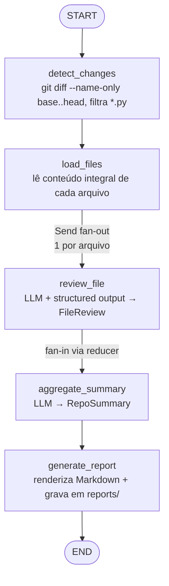

# AI Code Review Agent — Arquitetura

## 1. Objetivo

Agente autônomo, orquestrado com **LangGraph**, que analisa alterações em um projeto Python e produz um relatório técnico de code review em Markdown. O escopo de análise é o **arquivo inteiro** (não apenas o diff) de cada arquivo `.py` alterado entre dois refs Git.

## 2. Stack

| Camada            | Escolha                                                        |
| ----------------- | -------------------------------------------------------------- |
| Linguagem         | Python 3.12+                                                   |
| Orquestração      | LangGraph (`StateGraph`, `Send` para fan-out)                  |
| LLM               | Ollama `qwen3:8b` via `langchain-ollama.ChatOllama`            |
| Structured output | `llm.with_structured_output(PydanticSchema)`                   |
| Dependências      | `uv`                                                           |
| CLI               | `typer`                                                        |
| Saída             | Markdown em `reports/<repo>_<YYYYMMDD-HHMMSS>.md`              |

**Nota sobre Qwen3:** os prompts incluem o token `/no_think` para desligar o modo "thinking" (chain-of-thought expandido), reduzindo latência e consumo de tokens sem perder qualidade em tarefas estruturadas.

## 3. Estrutura de diretórios

```
ai_code_review_agent/
├── pyproject.toml
├── uv.lock
├── README.md
├── .gitignore
├── .python-version
├── docs/
│   ├── architecture.md          # este documento
│   └── prompts.md               # registro histórico de prompts
├── reports/                     # saída (gitignored)
├── src/
│   └── ai_code_review_agent/
│       ├── __init__.py
│       ├── cli.py               # entrypoint Typer
│       ├── config.py            # settings (modelo, host Ollama, refs default)
│       ├── llm.py               # factory ChatOllama
│       ├── state.py             # GraphState (TypedDict + reducers)
│       ├── models.py            # schemas Pydantic p/ structured output
│       ├── prompts.py           # templates de prompt (com /no_think)
│       ├── graph.py             # construção e compilação do StateGraph
│       ├── nodes/
│       │   ├── __init__.py
│       │   ├── detect_changes.py
│       │   ├── load_files.py
│       │   ├── review_file.py
│       │   ├── aggregate_summary.py
│       │   └── generate_report.py
│       └── tools/
│           ├── __init__.py
│           ├── git_tools.py     # diff, listagem de arquivos, leitura por ref
│           └── report_writer.py # formatação Markdown + escrita em disco
└── tests/
    ├── __init__.py
    ├── conftest.py
    ├── test_git_tools.py
    ├── test_nodes.py
    └── test_graph.py
```

**Separação por camadas** (models → tools → nodes → graph → cli) espelha a ordem esperada dos commits.

## 4. Componentes

### 4.1 `state.py` — Estado compartilhado

`GraphState` é um `TypedDict` que trafega por todos os nós. Campos acumulativos usam reducers do LangGraph (`operator.add`) para permitir fan-out seguro.

```python
class GraphState(TypedDict):
    # entrada
    repo_path: str
    base_ref: str                  # ex: "main"
    head_ref: str                  # ex: "HEAD"

    # descoberta
    changed_files: list[str]       # paths relativos de arquivos .py alterados

    # conteúdo carregado (path -> conteúdo integral do arquivo)
    file_contents: dict[str, str]

    # acumulado via reducer (fan-in dos reviews paralelos)
    file_reviews: Annotated[list[FileReview], operator.add]

    # síntese
    repo_summary: RepoSummary | None

    # saída
    report_path: str | None
    report_markdown: str | None
```

### 4.2 `models.py` — Schemas Pydantic

Usados como alvo de `.with_structured_output(...)`.

- **`Issue`**: `category` (`bug|security|performance|style|maintainability|test`), `severity` (`low|medium|high|critical`), `line` (opcional), `description`, `suggestion`.
- **`FileReview`**: `file_path`, `overall_score` (0-10), `summary`, `issues: list[Issue]`, `strengths: list[str]`.
- **`RepoSummary`**: `overall_assessment`, `total_issues_by_severity`, `top_priorities: list[str]`, `recommendations: list[str]`.

### 4.3 `tools/` — Ferramentas determinísticas

Funções puras, sem LLM. **Não** são "tools" no sentido de tool-calling da OpenAI — são utilitários chamados diretamente pelos nós.

- **`git_tools.py`**
  - `list_changed_python_files(repo_path, base_ref, head_ref) -> list[str]`
  - `read_file_at_ref(repo_path, path, ref) -> str` (lê o conteúdo do arquivo no ref `head`)
  - `get_repo_name(repo_path) -> str`
- **`report_writer.py`**
  - `render_markdown(state: GraphState) -> str`
  - `write_report(markdown: str, repo_name: str, out_dir: Path) -> Path`

### 4.4 `nodes/` — Nós do grafo

Cada nó é uma função `(state) -> partial_state`. Um nó = uma responsabilidade.

| Nó                    | Entrada                          | Saída                                | LLM? |
| --------------------- | -------------------------------- | ------------------------------------ | ---- |
| `detect_changes`      | `repo_path`, `base_ref`, `head_ref` | `changed_files`                  | Não  |
| `load_files`          | `changed_files`                  | `file_contents`                      | Não  |
| `review_file`         | um arquivo (via `Send`)          | `file_reviews` (append via reducer)  | Sim  |
| `aggregate_summary`   | `file_reviews`                   | `repo_summary`                       | Sim  |
| `generate_report`     | estado completo                  | `report_path`, `report_markdown`     | Não  |

### 4.5 `graph.py` — Construção do fluxo

Compila o `StateGraph` e expõe uma função `build_graph() -> CompiledGraph`. O fan-out por arquivo é feito com a API `Send` do LangGraph.

```python
def route_files(state: GraphState) -> list[Send]:
    return [Send("review_file", {"file_path": p, "content": state["file_contents"][p]})
            for p in state["changed_files"]]
```

### 4.6 `llm.py` — Factory do modelo

```python
def get_llm(temperature: float = 0.2) -> ChatOllama:
    return ChatOllama(model=settings.model, base_url=settings.ollama_host,
                      temperature=temperature)
```

### 4.7 `prompts.py` — Templates

Cada prompt começa com `/no_think` e é aplicado sobre um `ChatPromptTemplate`. Dois templates:
- `FILE_REVIEW_PROMPT` — recebe `file_path` e `content`, produz `FileReview`.
- `AGGREGATE_PROMPT` — recebe a lista de `FileReview`, produz `RepoSummary`.

### 4.8 `cli.py` — Entrypoint

```bash
uv run review \
  --repo . \
  --base main \
  --head HEAD \
  --out ./reports
```

## 5. Fluxo do agente



**Justificativa do fan-out:** cada arquivo é independente, então revisar em paralelo minimiza wall-clock. O reducer `operator.add` sobre `file_reviews` garante fan-in determinístico.

## 6. Decisões técnicas e trade-offs

- **Arquivo inteiro em vez de diff.** Dá ao LLM contexto completo (imports, funções auxiliares, estilo do arquivo) ao custo de mais tokens. Aceito porque melhora qualidade da revisão.
- **Structured output em vez de parse manual.** `with_structured_output` do LangChain valida a saída contra o schema Pydantic e re-tenta se falhar. Zero regex, zero JSON parsing frágil.
- **`Send` API em vez de loop sequencial.** LangGraph paraleliza a execução dos `review_file`. Alternativa (loop) seria mais simples mas serial.
- **Tools como funções puras, não `@tool`.** Não há tool-calling LLM aqui; os utilitários são chamados diretamente pelos nós. Reserva o padrão `@tool` para o dia em que um nó ReAct precisar delegar decisões ao modelo.
- **Ollama local em vez de API remota.** Sem custo por token e sem dependência de rede. Trade-off: `qwen3:8b` é menor que modelos hospedados; mitigado pelo escopo bem definido de cada chamada.
- **`/no_think`.** Qwen3 emite chain-of-thought verboso por padrão. Como confiamos no schema Pydantic para estruturar a saída, o "raciocínio explícito" traz pouco valor e muito custo.

## 7. Convenções do projeto

- **Registro de prompts:** todo prompt do usuário é anexado a `docs/prompts.md` com data, implementação e commits.
- **Commits:** curtos, em inglês, com prefixo convencional (`feat:`, `chore:`, `fix:`, `docs:`). Sem assinatura de IA.
- **Granularidade:** um commit por camada (`models` → `tools` → `nodes` → `graph` → `cli`) para o histórico contar a história.

## 8. Roadmap de implementação (ordem de commits)

1. `chore: bootstrap uv project` — `pyproject.toml`, deps (`langgraph`, `langchain-ollama`, `pydantic`, `typer`), `.gitignore`, `.python-version`.
2. `feat: add pydantic schemas for review output` — `models.py`.
3. `feat: add git and report tools` — `tools/git_tools.py`, `tools/report_writer.py`.
4. `feat: add graph state and llm factory` — `state.py`, `llm.py`, `config.py`, `prompts.py`.
5. `feat: add nodes` — `nodes/*.py`.
6. `feat: wire langgraph flow` — `graph.py`.
7. `feat: add typer cli` — `cli.py`.
8. `docs: add README with usage` — instruções finais.
